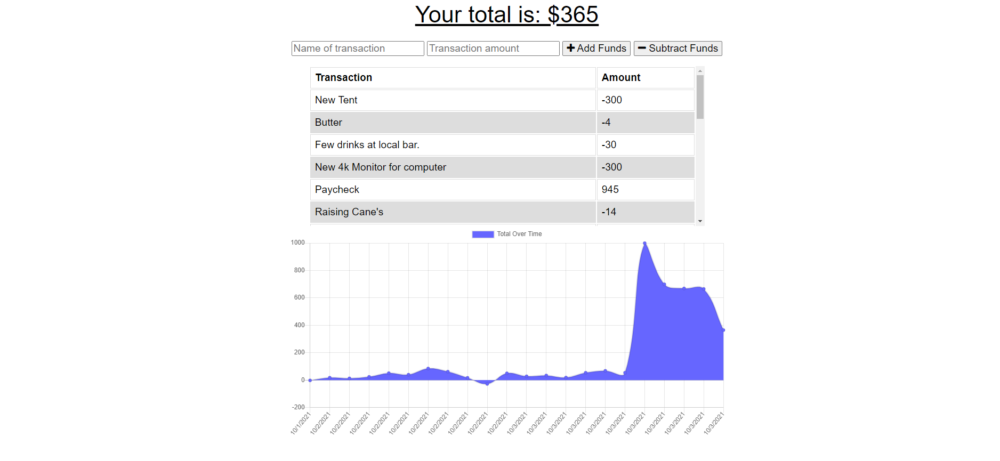
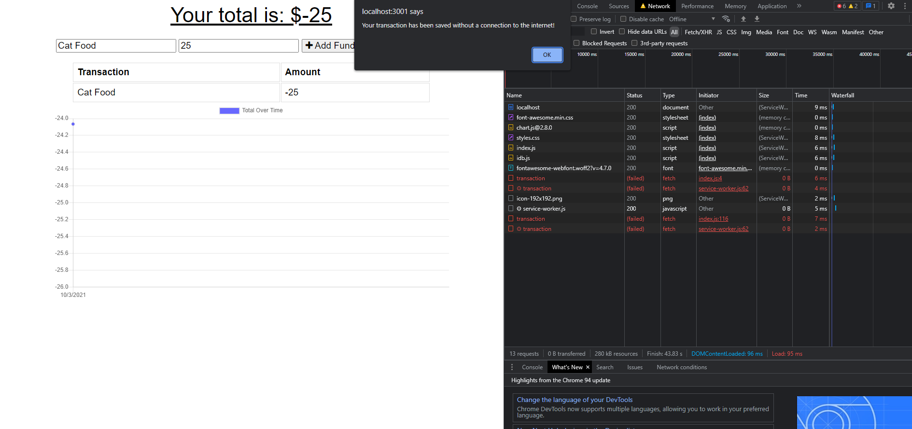
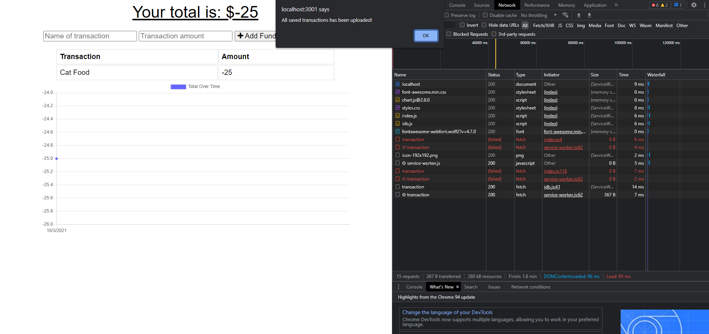
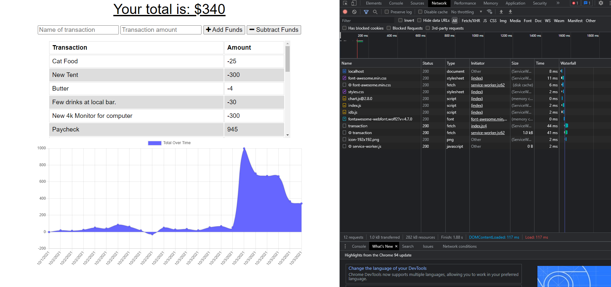

# Assignment 19 - Budget-Tracker

## Table of Contents  

* [Description](#description)
* [Installation](#installation)
* [Usage](#usage)
* [Contact Me](#contactMe)  

## Description  
This is a Progressive Web Application (PWA) that allows users to track purchases and deposits. if you are somewhere that does not have an internet connection, the application is still accessible as long as you have visited it with an internet connection. If using the app offline, when an internet connection is reestablished, the changes you made offline will be pushed and updated automatically.   

## Installation  
Clone the code from the repo, run "npm i" to install dependencies. Run "npm start" and navigate to "localhost:3001".  
This application was built with, JavaScript, Node, Express, MongoDB, Mongoose, IndexedBD, and Service Workers.  

## Usage  
App Online 
  
Offline Transaction
  
Transaction uploaded upon reconnection to internet.
  
Refreshed page with change made offline added to app.
  

## Contact Me  
App Deployed at [Heroku](https://quiet-coast-68077.herokuapp.com/) 
Check out my GitHub: [GinleyP87](https://github.com/GinleyP87) 
E-mail me: patginleyjr@gmail.com